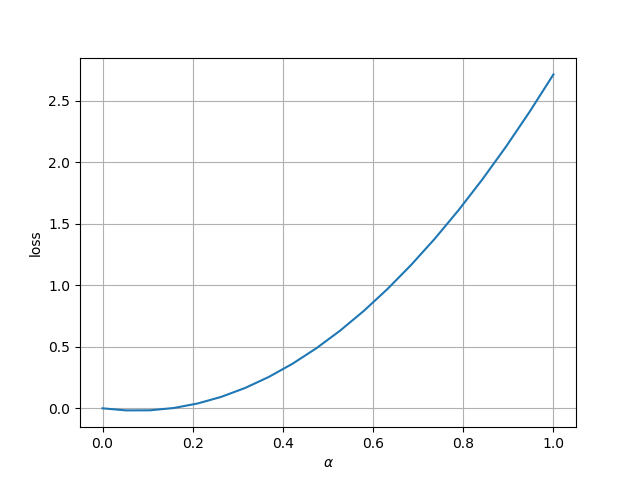
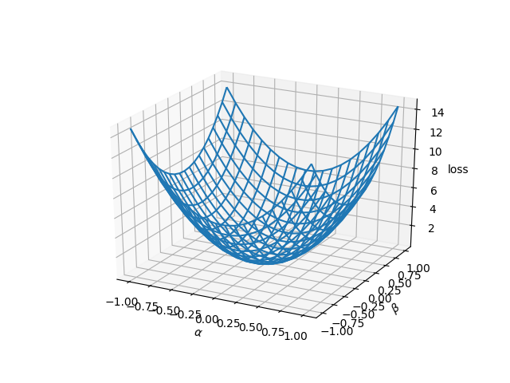
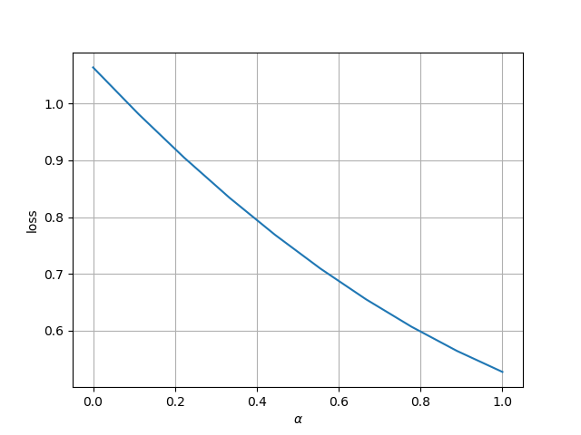
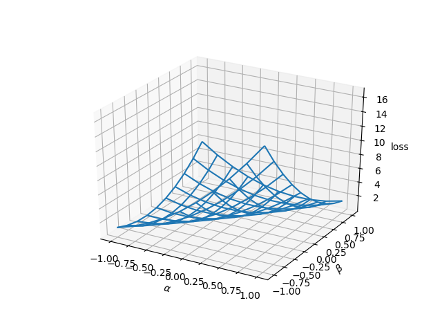
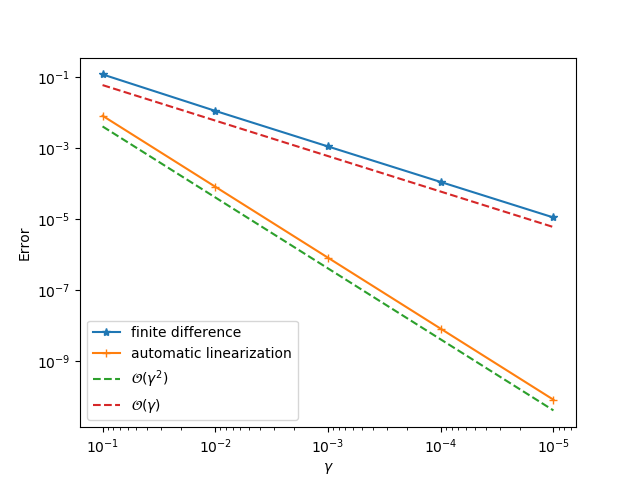

# ADCMEKit

ADCMEKit is used to facilitate inverse modeling using [ADCME](https://github.com/kailaix/ADCME.jl). 

## Basic Functions

`linedata(a, b)`: generate (1-α)a+αb as a function of α

`meshview(a)`: generate a `m×n` matrix in the neighborhood of `a`

```julia
loss1 = x->sum(x.^2-0.1*x)
v = linedata(zeros(10), rand(10))
l = loss1.(v)
lineview(l)

close("all")
v = landscapedata(zeros(10))
l = loss1.(v)
meshview(l)
```


| `lineview`           | `meshview`      |
| -------------------- | -------------------- |
|  |  |


## Use with ADCME 

`lineview(sess, pl, loss, θ1)`
```julia
pl = placeholder(Float64, shape=[2])
l = sum(pl^2-pl*0.1)
sess = Session(); init(sess)
lineview(sess, pl, l, rand(2))
```

`meshview(sess, pl, loss, θ1)`
```julia
pl = placeholder(Float64, shape=[2])
l = sum(pl^2-pl*0.1)
sess = Session(); init(sess)
meshview(sess, pl, l, rand(2))
```

`gradview(sess, pl, loss, u0)`: use with ADCME.jl to test gradients

```julia
pl = placeholder(Float64, shape=[2])
l = sum(pl^2-pl*0.1)
sess = Session(); init(sess)
gradview(sess, pl, l, rand(2))
```
| `lineview`           | `meshview`      | `gradview` |
| -------------------- | -------------------- | -------------------- |
|  |  |  |


## Units
The `Unit` module provides an interface to [Unitful.jl](https://github.com/PainterQubits/Unitful.jl)

```julia
Pa, kg, m, s = Unit.u"Pa, kg, m, s"
Unit.preferunits(Unit.u"g")
rho = 1000 * kg/m^3  |> value
K = 1e-7 * m^2/Pa/s |> value
qi = 10.0 * m^3/s |> value
qo = 0.0 * m^3/s |> value
```